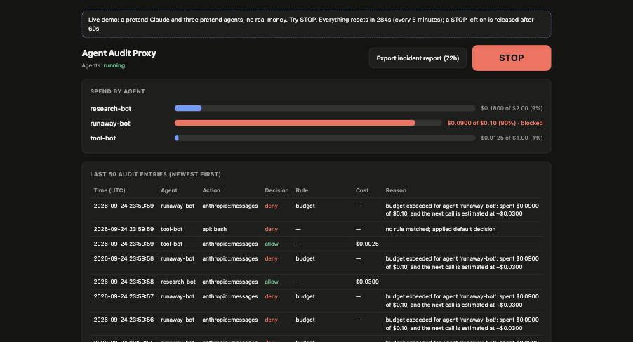

# Agent Audit Proxy

[](https://github.com/divijm12/agent-audit-proxy/actions/workflows/ci.yml)

[](LICENSE)

Runtime governance for AI agents built on Claude: **per-agent spending limits, tool-call
permissions, a global kill switch, and a tamper-evident audit trail** with one-click incident
reports. It runs as a proxy between your agents, the Anthropic API and your MCP tool servers,
so existing agents are governed without code changes.

**Live demo:** [agent-audit-proxy-demo.fly.dev/dashboard](https://agent-audit-proxy-demo.fly.dev/dashboard)
(simulated model and agents; no real API calls; resets every five minutes)



## Why

An autonomous agent repeats a loop: ask the model what to do, execute it, repeat. Unsupervised,
that loop can exhaust a budget overnight or execute a destructive command suggested by untrusted
input. Teams selling agents to enterprises are increasingly asked to show both **controls** (what
prevents this?) and **evidence** (what exactly did the agent do?). This project provides both.

## Features

| Capability | Description |
|---|---|
| **Spending limits** | Every model call is priced from the usage Anthropic reports. Each agent has a budget; a call that would exceed it is refused before it is sent. |
| **Tool permissions** | Every tool call is evaluated against a single YAML policy: `allow`, `deny` (with a reason returned to the agent), or `escalate` to a human. Covers MCP tools and tools defined directly in API requests. |
| **Kill switch** | One control (dashboard or `shugo halt`) freezes all model and tool calls immediately, including responses that are mid-stream. |
| **Audit trail** | Every decision is appended to a SHA-256 hash-chained log, verifiable end to end and against a saved anchor. |
| **Incident reports** | One-click export of the last *N* hours: totals, per-agent spend, blocked actions, kill-switch events, the full trail, and an integrity check. |

## Architecture

```
                         ┌───────────────────────────────┐
   Agent ───── MCP ─────▶│ Tool guard      (shugo serve) │────▶ MCP tool servers
     │                   │ policy · approvals · halt     │
     │                   └───────────────┬───────────────┘
     │                                   ▼
     │                        Hash-chained audit log ◀──── Dashboard · incident reports
     │                                   ▲
     │                   ┌───────────────┴───────────────┐
     └── Messages API ──▶│ Spend proxy     (shugo spend) │────▶ api.anthropic.com
     (ANTHROPIC_BASE_URL)│ halt · budget · pricing ·     │
                         │ policy on tool_use responses  │
                         └───────────────────────────────┘
```

Agents point `ANTHROPIC_BASE_URL` at the spend proxy and identify themselves with an
`x-agent-id` header. API keys pass through to Anthropic and are never stored or logged.

### How tool calls are enforced

Claude requests tools through structured `tool_use` blocks, never through free text, so
enforcement is exact rather than heuristic. There are two enforcement points:

| | Spend proxy | Tool guard |
|---|---|---|
| **Sees** | Every `tool_use` block in Claude's responses, MCP or not | The actual MCP `tools/call` the agent executes |
| **Enforces** | Denied calls are replaced with an explanation before the agent receives them; streamed tool calls are buffered until complete, then judged | Denied calls never reach the MCP server |
| **Required for** | Tools defined in the agent's own code | Defense in depth for MCP tools |

Allowed responses pass through unmodified; streaming responses remain byte-identical.

## Results

All figures are reproducible. The evaluation suite ([`evals/RESULTS.md`](evals/RESULTS.md))
runs against a simulated Anthropic API at no cost; the real-API test
([`evals/real_claude_test.py`](evals/real_claude_test.py)) enforces its own $0.30 ceiling
independently of the proxy under test.

| Evaluation | Target | Result |
|---|---|---|
| Runaway agent, **real Claude Haiku 4.5**, $0.10 budget | Stop at budget | **Stopped at $0.098** after 11 calls; proxy ledger matched actual usage exactly |
| Runaway agent, simulated, $0.50 budget ($50 unsupervised) | Stop at budget | **Stopped at $0.48** (constant and growing per-call cost) |
| Adversarial tool calls blocked (20 attacks, standard + streaming) | 100% | **40 / 40** |
| Benign tool calls incorrectly blocked (10 cases, standard + streaming) | 0% | **0 / 20** |
| Log tampering detected (7 attack classes) | All | **7 / 7** with anchor; 5 / 7 by chain alone |
| Added latency, p50 / p95 | < 20 ms | **1.3 / 1.5 ms**; time to first streamed byte 0.7 / 0.9 ms |

Latency depends on the machine and its load: across repeated runs on an Apple-silicon laptop,
the added p50 ranged from 1.3 to 2.1 ms. All other figures are deterministic.

## Quick start

Requires Python 3.11+ and [uv](https://docs.astral.sh/uv/).

```bash
uv tool install git+https://github.com/divijm12/agent-audit-proxy
shugo spend demo                     # simulated agents: http://127.0.0.1:8787/dashboard
```

## Use it with your own agent

Works with any agent that calls Claude through the Anthropic Messages API.

**1. Set budgets.** Create `spend.yaml`:

```yaml
default_budget_usd: 5.00             # any agent not listed below
agents:
  support-bot: {budget_usd: 20.00}
```

**2. Start the proxy.**

```bash
shugo spend serve -c spend.yaml      # dashboard: http://127.0.0.1:8787/dashboard
```

**3. Point your agent at it.** This is the only change to your agent. Your API key is still
yours and passes through to Anthropic unchanged. `x-agent-id` names the agent for budgets,
the dashboard and the audit log; agents without it share the `default` budget.

```python
# Python SDK
client = anthropic.Anthropic(base_url="http://127.0.0.1:8787",
                             default_headers={"x-agent-id": "support-bot"})
```

```typescript
// TypeScript SDK
const client = new Anthropic({ baseURL: "http://127.0.0.1:8787",
                               defaultHeaders: { "x-agent-id": "support-bot" } });
```

```bash
# Claude Code and the Claude Agent SDK
export ANTHROPIC_BASE_URL=http://127.0.0.1:8787
export ANTHROPIC_CUSTOM_HEADERS="x-agent-id: coding-agent"
```

**4. Check it's working.** Run your agent, then open the dashboard or run `shugo spend status`:
the agent appears with its spend. When it reaches its budget, its next call fails with a
`402 billing_error` explaining why.

### Optional: block dangerous tool calls

Create `guardrails.yaml` next to `spend.yaml`. The first matching rule wins, and anything
unmatched is denied:

```yaml
version: "0.1"
defaults: {decision: deny}
rules:
  - id: no-recursive-delete
    match: {server: api, tool: bash, args_regex: {command: 'rm\s+-\w*[rR]'}}
    decision: deny
    reason: Recursive deletes are prohibited.
  - id: read-only-shell
    match: {server: api, tool: bash, args_regex: {command: '^(ls|pwd|git (status|diff|log))( [\w./-]+)*$'}}
    decision: allow
```

Then add to `spend.yaml` and restart the proxy:

```yaml
tool_policy:
  policy: guardrails.yaml            # relative to spend.yaml
  on_deny: rewrite                   # or: error
```

`server: api` refers to tools your agent defines in its own code; `tool` is the name Claude
calls. A denied call is replaced with the reason before your agent receives it.

### Optional: guard MCP tools

List your MCP servers under `upstreams` in a `guardrails.yaml` (or generate one from your
existing client config with `shugo init`):

```yaml
version: "0.1"
defaults: {decision: deny}
upstreams:
  github:
    command: npx
    args: ["-y", "@modelcontextprotocol/server-github"]
rules:
  - id: github-read-only
    match: {server: github, tool: ["get_*", "list_*", "search_*"]}
    decision: allow
```

Then register the guard in your MCP client (Claude Desktop, Claude Code, Cursor) in place of
those servers. Their tools appear as `github__get_repo` and so on:

```json
{ "mcpServers": { "guarded": { "command": "shugo",
                               "args": ["serve", "--config", "/absolute/path/to/guardrails.yaml"] } } }
```

Both proxies share one audit log and one kill switch (in `~/.shugo`) when they run on the same
machine. Other commands: `shugo halt` / `shugo unhalt`, `shugo audit report --hours 72 -o report.md`,
`shugo audit verify --anchor <hash>`, `shugo approve --watch`. More in [`examples/`](examples/) and
the [policy guide](docs/policy-guide.md).

## Contributing

```bash
git clone https://github.com/divijm12/agent-audit-proxy && cd agent-audit-proxy
uv sync --extra dev && uv run --extra dev pytest
```

## Deployment

A `Dockerfile` and `fly.toml` are included. Internet-facing deployments require
`SHUGO_DASHBOARD_PASSWORD` (the proxy refuses to bind a public interface without it) and should
set `SHUGO_AGENT_TOKEN`. See [`docs/deploy.md`](docs/deploy.md).

## Limitations

- **Cost is known only after a call.** Budgets are enforced on an estimate derived from the
  agent's previous call. This is exact for repetitive loops; the first call, or a call costlier
  than its predecessor, can exceed the budget by at most the difference. Budgets are cumulative;
  periodic resets are not yet supported.
- **Visibility is limited to traffic through the proxy.** Actions an agent's code takes without
  a model request, and agents that execute code written in free-text responses, are outside its
  view. Anthropic-hosted tools (web search, code execution, the MCP connector) execute before the
  response reaches the proxy and cannot be blocked by it.
- **Policies are only as strong as their design.** Allow-lists are recommended over pattern
  blocklists. The red-team policy and attacks share an author, so the 40/40 result validates the
  mechanism rather than proving the absence of bypasses.
- **The audit log is tamper-evident, not tamper-proof.** The hash chain is unkeyed; tail
  truncation and full rewrites are detected only against an externally stored anchor (printed
  in every incident report).
- **Rewriting denied calls edits conversation history.** Models that reject edited history
  should use `on_deny: error`.
- **Single instance.** The spend ledger uses SQLite; horizontal scaling is not supported.
- **Anthropic Messages API only.** Other providers are not yet supported.

## Comparison

| | Per-agent budgets | Tool-call policy | Kill switch (model + tools) | Verifiable audit trail |
|---|---|---|---|---|
| LiteLLM / Portkey / Helicone | Per key or team | Varies by product | Key revocation | Request logs |
| Anthropic Console | Per workspace (monthly) | No | Key revocation | Usage reports |
| [agentguard](https://github.com/agentwares/agentguard) | Per run / per day | MCP | Yes | Hash-chained |
| **Agent Audit Proxy** | Yes, enforced pre-call | MCP and API-defined tools | Yes | Hash-chained, anchored, exportable |

Gateways such as LiteLLM support many providers and routing, which this project does not.

## Compliance context

Illinois' Artificial Intelligence Safety Measures Act (SB 315, 2026) requires large frontier
model developers to report critical safety incidents within 72 hours. It does not apply to
companies deploying those models, but it signals the documentation enterprise customers will
expect. The incident report follows that timeline; it is not a regulatory filing.
See [`docs/illinois-sb315.md`](docs/illinois-sb315.md).

## Acknowledgements and license

Built on [shugo](https://github.com/aritraghosh01/shugo) by aritraghosh01 (MIT), which provides
the MCP tool guard, policy engine, approvals and audit log; its original documentation is in
[`docs/shugo-README.md`](docs/shugo-README.md). Fixes developed here were contributed upstream
([#13](https://github.com/aritraghosh01/shugo/pull/13), [#14](https://github.com/aritraghosh01/shugo/pull/14)).
The spending-limit design was informed by [costfuse](https://github.com/costfuse/costfuse).

Released under the [MIT License](LICENSE).
